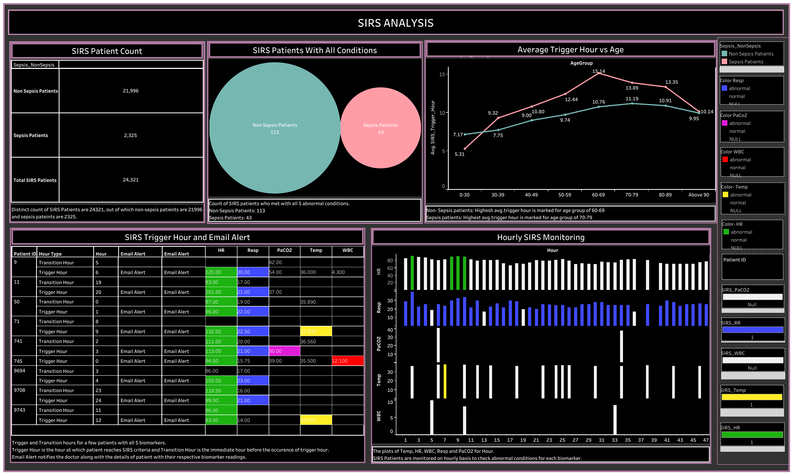

🩺 SIRS Analysis – Sepsis Monitoring Dashboard

📌 Project Overview

This project presents a healthcare-focused dashboard analyzing Systemic Inflammatory Response Syndrome (SIRS) patients to detect and monitor sepsis triggers. The dashboard provides clinicians with actionable insights into patient vitals, abnormal biomarker conditions, and automated alert tracking for timely interventions.

🎯 Objective

To support early sepsis detection and improve patient outcomes by enabling stakeholders to:

Track SIRS patients segmented into Sepsis vs Non-Sepsis groups

Identify patients with abnormal biomarker combinations (HR, Resp, PaCO₂, Temp, WBC)

Monitor hourly trends and trigger times for critical alerts

Compare patient profiles by age vs trigger hours

Log and visualize automated physician alerts

🔑 Key Features

Patient Count Summary: Breakdown of total SIRS cases into Sepsis and Non-Sepsis categories

Condition Analysis: Patients meeting all 5 abnormal biomarker conditions

Trigger Hour vs Age Chart: Sepsis and Non-Sepsis trigger time distribution across age groups

Email Alert Table: Captures abnormal vitals with timestamps and physician notifications

Hourly Monitoring View: Trends in HR, Resp, PaCO₂, Temp, and WBC

🧮 Analysis Highlights

Defined trigger hours based on biomarker thresholds

Built transition tracking to capture when a patient condition shifts from normal to abnormal

Compared average trigger hours across age groups

Implemented alert logging to simulate real-time monitoring

🛠Tools & Skills

SQL: Data extraction and cleaning

Python (Pandas, NumPy, Matplotlib): Data preprocessing & visualization

Tableau: Interactive dashboard creation

Excel: KPI tracking and exploratory analysis

📚 What I Learned

Designing healthcare dashboards with patient-centric KPIs

Tracking transitions and conditions using trigger-based logic

Communicating insights effectively for clinical decision-making

Combining SQL + Python preprocessing with Tableau visualization

📊 Data Source

Synthetic healthcare dataset with patient vitals and biomarker readings:

Fact Table: Patient biomarker readings (hourly)

Dimensions: Patient demographics, conditions, alert logs

🌐 Connect With Me

For more projects and updates, feel free to visit my profiles:

- GitHub: [Keerthi's GitHub Profile](https://github.com/Keerthikadiyala91)  
- LinkedIn: [Keerthi's LinkedIn Profile](https://www.linkedin.com/in/keerthi-k-47868154/)
- Tableau: [Keerthi's Tableau Profile](https://public.tableau.com/app/profile/keerthi5467/vizzes)

